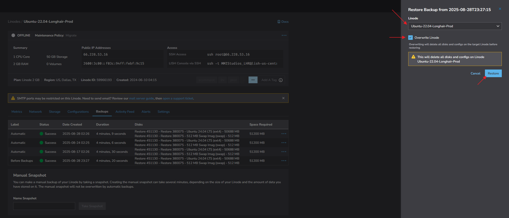

# Longhair Records — Server Maintenance

The Longhair Records website runs on a Linode Server deployment running a LAMP (Linux, Apache, MySQL, PHP) stack that utilizes the WordPress CMS (Content Management System) and its WooCommerce integrations for Ecommerce support.

## Linode Dashboard

Linode, an is a cloud computing platform that provides virtual machines (called Linodes) and other services for businesses and individuals to build, deploy, and scale applications in the cloud. It offers a user-friendly interface and a variety of server types, scalable resources (cpu's, memory, storage, etc.), for different workloads. This is where the Longhair Records ecommerce site is deployed. We'll go over some of the things we can do in the Linode dashboard relevant to maintaining the site.

### Linode Users

You should have received an invitation to manage the Longhair Records server on the Linode dashboard. If you have not received an invitation, let the admin (resonance.designs.com@gmail.com) know. All the documentation below is for invited users. After you receive the invite and have set your password, you should be able to do all the actions documented below.

#### Creating Accounts And Accessing Server

1. To create/activate your account, you will need to click the link in the email you received from Linode. You will be prompted to set a password for your account. Set your password and then you have successfully activated your account.
2. Log in to the Longhair Records server using the password you just set.
3. After logging in, click on the "Linodes" tab in the left sidebar.
4. You should see a list of "Linodes" after logging in. Specifically, there should be a "Linode" called "Ubuntu-22.04-Longhair-Prod". Click on it:

   

---

### Linode Backups

#### Creating Backups

1. First, it is recommended that you shut down the Linode server before creating a backup. You can do this by clicking on the "Actions" button and then selecting "Power Off":

   

   * You can create a backup while the server is running, but it is highly suggested that you shut it down first. It is only recommended to create a backup while the server is running if there is an emergency situation where shutting down the server would cause a data loss, or it is simply not possible to shut it down.
   * Once initiating the “Power Off” action, you will see an indicator that the server is shutting down:

     
   * And an indicator once the server has shut down:

     
2. After it is powered off, you can create a backup by clicking on the "Backups" tab:

   

   1. Once in the "Backups" tab, you will see a list of backups already created. Some backups are created automatically, and some are created manually. You can tell which are automatically created by the "Label" column. The label will display as "Automatic" if it was automatically created, and it will display as the label/title given during the process of creating the manual backup. For example, a backup with the label "Before Updates" will indicate that it was created manually:

      
   2. To create a manual backup, you will see a section called "Manual Snapshot" below the list of backups. Simply type in the name of the backup you want to create and click the "Take Snapshot" button.

      

      The backup will be created, and you will be notified when it is complete You should be aware that any new manual backup will overwrite the previous The account only allows one manual backup.
      <br>
   3. Once the backup is complete, you can power the server back on by clicking on the "Actions" button and then selecting "Power On".

#### Restoring A Backup

1. Again, it is recommended that you shut down the Linode server before restoring a backup. You can do this by clicking on the "Actions" button and then selecting "Power Off":

   
2. After the Linode Server is powered off, you can restore a backup by clicking on the "Backups" tab, select the "Actions" button for the backup, and then select the "Restore to Existing Linode":

   

   1. This will open a menu to the right. In that menu, select the "Ubuntu-22.04-Longhair-Prod" Linode and then click the "Overwrite Linode" checkbox. Then click the "Restore" button to restore the backup to the Linode server:

      

      NOTE: It’s important to make sure that the “Overwrite Linode” box is checked. If you do not make sure this check-box is selected, it will restore the backup on a new, separate server and the account will incur charges for that new server.
      <br>
3. Once the restore is complete, power the server back on by clicking on the "Actions" button and then selecting "Power On":

   

---

### Linode Terminal

[ IN PROGRESS ]

## Remote Server Terminal

A remote server terminal is a text-based interface that allows a user to remotely connect to and manage a server over a network, typically using protocols like SSH. It provides access to a server's command-line interface (CLI) for running commands, managing files, and executing scripts without needing a direct physical connection. This enables users to perform administrative tasks and develop applications on a server from any location, using their local machine as the "terminal". In this section we will go over various tasks we can perform in the server terminal relevant to maintaining the site.

ALERT: If you are inexperienced with operating in a server terminal and performing linux commands, it is recommended to make a backup from the Linode dashboard first, before attempting any of the maintenance operations listed in this section.

### Accessing The Terminal

The simplest method of accessing the server terminal is from the Linode dashboard as discussed in the Linode Dashboard section above. However, this interface can be a bit clunky. For a better experience, you can access it from your computer without having to log in to the Linode dashboard.

1. Install Git for Windows:

   1. Download the [Windows installer](https://git-scm.com/downloads/win) and open when the download has finished.
   2. During the Git for Windows installation, you are often presented with an option to choose whether to use the bundled OpenSSH client or an external, possibly Windows-native, OpenSSH client if one is already present on your system. Select the Git for Windows' bundled OpenSSH client:
2. Git for Windows installs a number of tools, one of which is Git Bash, open it:
3. In Git Bash, enter the following and hit enter:

   ```
   ssh username@66.228.53.16
   ```

   Replace `username` with your username. If you do not have a user account for the server, contact [resonance.designs.com@gmail.com](mailto:resonance.designs.com@gmail.com) to request one.
4. Once it makes the connection it will prompt you for your password. Enter the password that was provided to you by the admin.
5. It may also prompt you to store an ssh key. If it does, select "yes".

If everything goes smoothly, you should now be connected to the remote server terminal:

---

### Server Tasks

Below are a number of tasks we can perform to maintain, diagnose, and trouble-shoot the server from the terminal. These tasks can be performed from the Linode dashboard terminal or from the remote server terminal as described in the sections above. In the future we can probably move some of these to execute from a script and on a task scheduler so we don't have to manually enter these commands.

#### Remove Extraneous Image Files

To remove redundant image files after a WooCommerce Square sync, run the following commands:

- Run the remove command on the appropriate files:

   ```
   sudo find /var/www/html/longhairrecords/wp-content/uploads/ -type f \
   -regex '.*\(1024x1024\|1080x1080\|1080x675\|1280x1280\|1536x1536\|1920x1800\|400x250\|400x284\|400x516\|480x480\|510x382\|768x768\|980x980\).*' \
   -delete
   ```

#### Clear MySQL Binary Logs

To clean out the binary logs of the MySQL database, run the following commands:

1. Connect to the MySQL terminal:

   ```
   sudo mysql
   ```

   You should now be connected to the MySQL terminal:
2. To purge the binary logs of the MySQL database older than 7 days, run this command from the MySQL prompt:

   ```
   PURGE BINARY LOGS BEFORE DATE_SUB( NOW( ), INTERVAL 7 DAY);
   ```
3. To purge the binary logs of the MySQL database up till now, run this command from the MySQL prompt:

   ```
   PURGE BINARY LOGS BEFORE now();
   ```

#### Clean APT Cache

To clean out old packages (applications) and associated cache files, run this command:

```
sudo apt autoremove && sudo apt clean && sudo apt autoremove --purge
```

